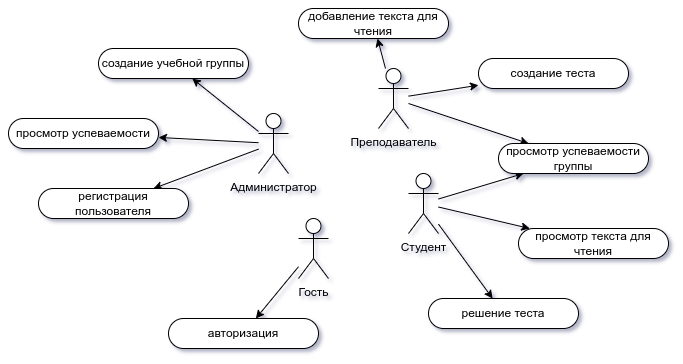
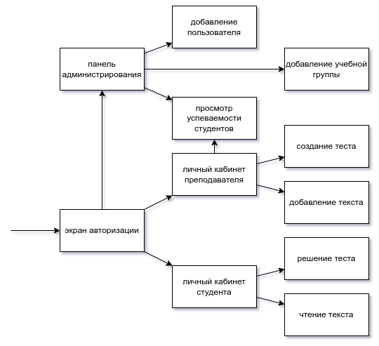
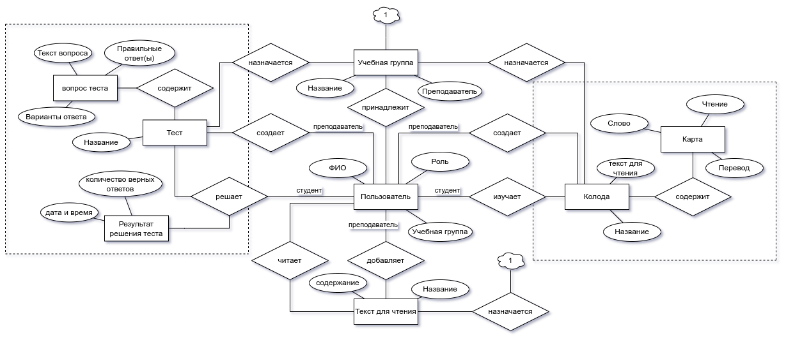

# Система контроля выполнения домашних заданий по дисциплине "английский язык"

- цель работы: облегчить преподавателю английского языка контроль за выполнением домашнего задания и предоставить студенту функционал для облегчения обучения иностранному языку; 

- перечень функциональных требований:

    1. Обеспечить администратору возможность регистрирования новых пользователей, а также созданию учебных групп.

    2. Обеспечить преподавателю возможность добавлять в систему тесты, задавать для них ограничение по времени, а также добавлять тексты для изучения и формировать колоды карт, состоящих из слов, которые необходимо изучить в данном модуле.  

    3. Предоставить студенту возможность решать тесты, читать тексты и изучать колоды. При этом необходимо обеспечить возможность формирования пользовательских колод, а также перевод слов при наведении на них при чтении текста.

- use-case:

- черновик экранов:

- ER-диаграмма:

